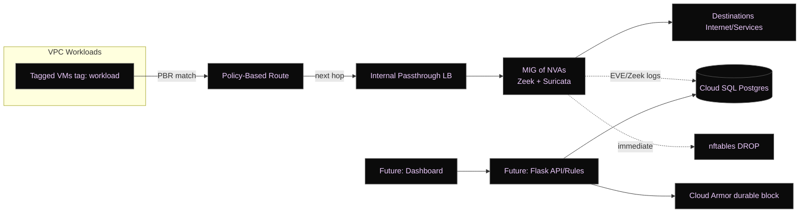

# NetProbe

**Agentless inline inspection on Google Cloud** using **Policy-Based Routing (PBR) → Internal Passthrough Load Balancer (ILB)** → **Network Virtual Appliances (NVAs)** running **Zeek** + **Suricata**, with logs persisted to **Cloud SQL (PostgreSQL)** and a lightweight **log-shipper**.

> Why NetProbe? Many teams want real-time prevent/detect without agents or expensive mirroring. NetProbe inserts a scalable inspection tier **in-path**, enriches events, and supports fast response (host-level `nftables` + durable Google Cloud Armor rules).

## Architecture (at a glance)



* **Data plane**: Workloads → PBR → ILB → NVAs → Destinations
* **Persistence**: NVAs → Cloud SQL (via log-shipper)
* **Response**: host-level `nftables` (instant), Cloud Armor (edge/durable)
* **IaC**: Terraform modules for VPC, subnets, ILB, MIG, PBR, Cloud SQL, IAM, firewalls

Prerequisites

* **gcloud** CLI + Application Default Credentials:

  ```bash
  gcloud auth application-default login
  gcloud auth login
  gcloud config set project <YOUR_PROJECT_ID>
  ```
* **Terraform ≥ 1.5**, **Python 3.9+**
* A **GCS bucket** for Terraform state (edit `backend.tf` or create the bucket name used there).
* Billing enabled on the project.

> Cost control: default `nva_instance_count = 0`. Set it > 0 only when you want to bring up the MIG and start inline inspection.


## Secrets & Required APIs

Enable core services (Terraform also does this, but enabling up front helps first runs):

```bash
gcloud services enable networkconnectivity.googleapis.com \
  secretmanager.googleapis.com servicenetworking.googleapis.com sqladmin.googleapis.com
```

Create secrets used by the startup script:

```bash
# Cloud SQL DB user password
echo -n 'STRONG_DB_PASSWORD' | gcloud secrets create db-password --data-file=-

# GitHub Personal Access Token (scoped to read the repo)
echo -n 'ghp_xxx' | gcloud secrets create github-pat --data-file=-
```

> The startup template pulls these via `gcloud secrets versions access ...` on the NVA.


## Deploy (Terraform)

1. **Set variables** in `infra/terraform/terraform.tfvars`:

```hcl
project_id  = "your-gcp-project"
region      = "your-region"
db_password = "STRONG_DB_PASSWORD"  # used for initial SQL user creation
nva_instance_count = 0              # start with 0 (no MIG yet)
branch_name = "main"
app_version = "initial"             # any string to trigger template rollouts
```

2. **Initialize & plan/apply**:

```bash
cd infra/terraform
terraform init
terraform plan -out plan.tfplan
terraform apply plan.tfplan
```

3. **(Optional) Bring up the NVAs & test workload**:

   * Set `nva_instance_count = 1` (or more)
   * `terraform apply` again

> The NVA startup script installs Zeek + Suricata, enables IP forwarding, applies a **MASQUERADE** NAT rule, then deploys the **log-shipper** and its `systemd` unit with DB credentials injected.

## How PBR & ILB routing works here

* **`pbr_skip_nva` (priority 700)**: lets NVA-originated traffic use default routing (prevents loops).
* **`pbr_allow_nva_to_internal` (priority 650)**: ensures NVA can reach internal/private services (Cloud SQL, etc.).
* **`pbr_to_nva` (priority 800)**: for **workload-tagged** VMs, sends all traffic to the **ILB** (next hop) → MIG NVAs.

> Tag your real workloads with `workload` (or adjust the PBR filter) to steer selected traffic to inspection.

## Log-Shipper (apps/log-shipper)

**`shipper.py`** tails Zeek `conn.log` and writes batches to Postgres.

**Env vars**

| Variable      | Default         | Purpose                                       |
| ------------- | --------------- | --------------------------------------------- |
| `DB_HOST`     | `db`            | Postgres host (Cloud SQL private IP)          |
| `DB_NAME`     | `netprobe_logs` | Database name                                 |
| `DB_USER`     | `netprobe_user` | Database user                                 |
| `DB_PASSWORD` | *(required)*    | Password (pulled from Secret Manager on NVAs) |

**Run locally (optional)**

```bash
export DB_HOST=127.0.0.1 DB_NAME=netprobe_logs DB_USER=netprobe_user DB_PASSWORD=pass
python3 apps/log-shipper/shipper.py --file /path/to/zeek/conn.log
```

**systemd unit** (`apps/log-shipper/shipper.service`)
The NVA startup script templates DB env values and installs this as `/etc/systemd/system/shipper.service`, then enables + starts it.

## Database Schema (minimum)

The shipper inserts into a `connections` table and expects **unique `uid`** (due to `ON CONFLICT (uid) DO NOTHING`). Define the table like this:

```sql
CREATE TABLE IF NOT EXISTS connections (
  ts            double precision,               -- Zeek epoch timestamp (float)
  uid           text PRIMARY KEY,
  source_ip     inet NOT NULL,
  source_port   integer,
  destination_ip inet NOT NULL,
  destination_port integer,
  proto         text,
  service       text,
  duration      double precision,
  orig_bytes    bigint,
  resp_bytes    bigint,
  conn_state    text
);

-- Helpful indexes for queries
CREATE INDEX IF NOT EXISTS idx_connections_ts ON connections (ts);
CREATE INDEX IF NOT EXISTS idx_connections_src ON connections (source_ip);
CREATE INDEX IF NOT EXISTS idx_connections_dst ON connections (destination_ip);

-- Optional: a view converting epoch -> timestamptz for easier reading
CREATE OR REPLACE VIEW connections_readable AS
SELECT
  to_timestamp(ts) AT TIME ZONE 'UTC' AS ts_utc,
  *
FROM connections;
```

> If you prefer storing `ts` as `timestamptz`, modify the Python insert to call `to_timestamp(%s)` in SQL. The above schema keeps the app code unchanged.

## Verifying the Deployment

* **NVAs healthy?**

  ```bash
  gcloud compute instance-groups managed list
  gcloud compute health-checks list
  ```
* **ILB set & backends attached?**

  ```bash
  gcloud compute forwarding-rules list --regions <region>
  gcloud compute backend-services list --regions <region>
  ```
* **Routes/PBR correct?**

  ```bash
  gcloud network-connectivity policy-based-routes list
  gcloud compute routes list --filter="network:netprobe-vpc"
  ```
* **On an NVA VM (IAP SSH):**

  ```bash
  sudo journalctl -u zeek -e
  sudo systemctl status suricata
  sudo systemctl status shipper
  sudo tail -f /var/log/startup-script.log
  sudo iptables -t nat -S | grep MASQUERADE
  ```
* **Data landing in SQL?**

  ```sql
  SELECT COUNT(*) FROM connections;
  SELECT * FROM connections_readable ORDER BY ts_utc DESC LIMIT 10;
  ```

## Operations

* **Scale MIG**: set `nva_instance_count` and `terraform apply`.
* **Roll NVAs** (e.g., change code or config): bump `app_version` (e.g., commit SHA) and `terraform apply`.
* **Rotate DB password**: update Secret Manager `db-password`, restart shipper service on NVAs (or re-roll MIG).
* **Update Suricata rules / Zeek configs**: bake into startup template or use a post-boot script; roll MIG.

## Cost Controls

* Keep `nva_instance_count = 0` when idle.
* Use small shapes (e2-medium is the current template).
* Cloud SQL (small SSD 10GB, zonal) for dev; disable backups in dev (enabled by default in prod!).
* Avoid full-mesh inspection; PBR can target only required sources.
  
## Security Notes

* NVAs need **`can_ip_forward=true`** and the **MASQUERADE** NAT rule to ensure forwarded egress works.
* Cloud SQL is **private IP only** (no public IP).
* IAM: Secret Manager **Accessor** role is granted to the compute SA (see `iam.tf`).
* SSH via **IAP** only; firewall restricts health-check ranges and admin access.

## Local Dev Tips

* Spin up Postgres in Docker:

  ```bash
  docker run -e POSTGRES_PASSWORD=pass -e POSTGRES_DB=netprobe_logs \
    -p 5432:5432 --name npg postgres:15
  ```
* Point the shipper at a sample `conn.log`:

  ```bash
  python3 apps/log-shipper/shipper.py --file ./sample/conn.log
  ```

## Troubleshooting

* **ILB backends “UNHEALTHY”**
  Ensure `allow_health_checks` firewall is applied to `target_tags=["nva"]`; NVAs listening on TCP/22 (as per health check).
* **No traffic reaching NVAs**
  Verify `pbr_to_nva` applies to VMs with tag `workload`; confirm forwarding rule network/subnet match.
* **NVAs can’t reach internet/Cloud SQL**
  Confirm `pbr_skip_nva` and `pbr_allow_nva_to_internal` exist and have *higher* priority than `pbr_to_nva`; ensure **MASQUERADE** rule present.
* **Shipper not inserting**
  Check `DB_PASSWORD` is set in templated unit; `connections` table exists; Postgres accepts from NVA subnet; see `journalctl -u shipper`.
* **Suricata/Zeek not logging**
  Check interfaces set in `/opt/zeek/etc/node.cfg` and `/etc/suricata/suricata.yaml` (startup script auto-detects default interface).

## Roadmap

* API (Flask) + UI (React on Cloud Run)
* SIEM export and dashboards
* Containerized NVA images & image pipeline
* Rule update automation (`suricata-update`)
* Cloud Armor integration path (durable blocklists)

## Acknowledgements

Open-source communities behind **Zeek** and **Suricata**. Google Cloud docs for PBR/ILB/Cloud SQL. Internal notes, design docs, and debugging logs that shaped this reference implementation.

---

### Appendix: What the NVA startup does (quick recap)

1. Installs **Zeek LTS** + **Suricata** on Debian 11
2. Configures interfaces, enables **`ip_forward`**
3. Adds **`iptables -t nat -A POSTROUTING -o <iface> -j MASQUERADE`** and persists rules
4. Pulls secrets from **Secret Manager**
5. Clones repo (`branch_name`), installs `psycopg2`, templates the **`shipper.service`**, and starts it
6. Registers **Zeek** & **Suricata** with `systemd`, enables & starts services

---

